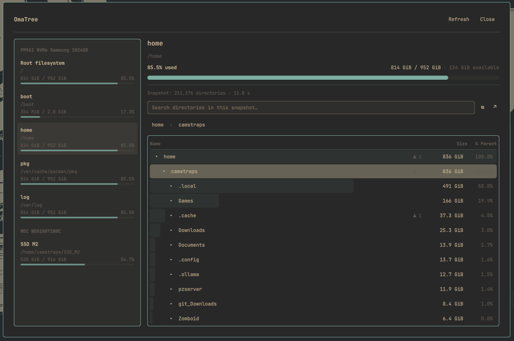
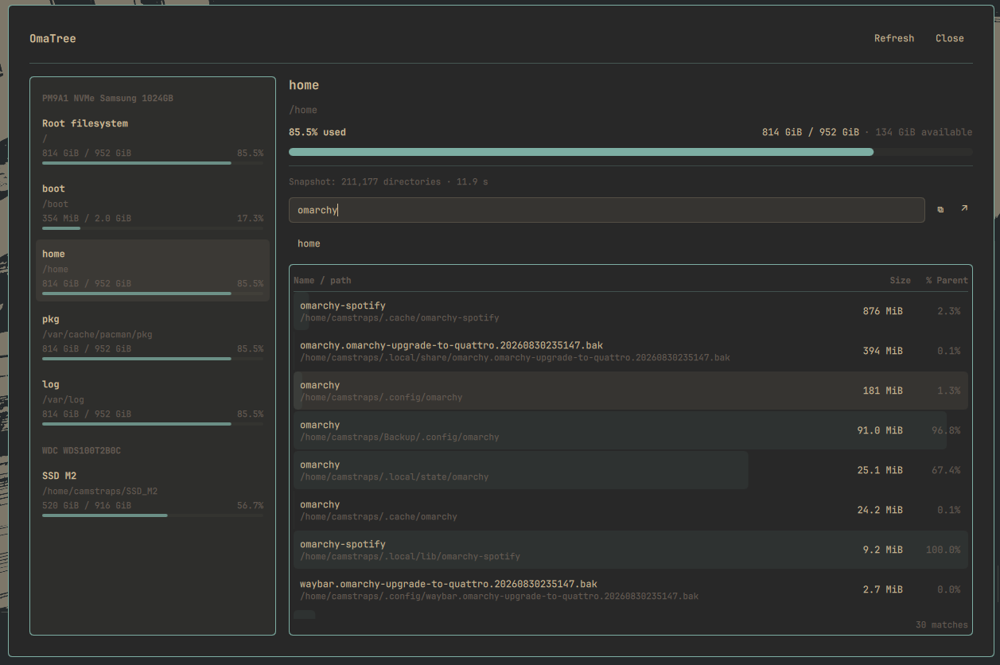

# OmaTree

OmaTree is a native Omarchy disk usage analyzer inspired by TreeSize and
ncdu. It presents mounted filesystems and their directory usage through an
Omarchy/Quickshell panel, a bar widget, and an optional terminal interface.

## Features

- Native Omarchy panel and bar widget
- Filesystem capacity overview and physical-disk grouping where available
- Filesystem-aware scans with explicit nested-mount pruning
- SQLite-backed snapshots with bounded, lazy directory pages in Quickshell
- Expandable directory tree with size and percentage-of-parent visualization
- Snapshot-wide directory search and breadcrumb navigation without rescanning
- Copy Path and Open Folder actions
- Symlinks are never followed
- Hard-linked files are counted once per scan
- Allocated-size accounting using `st_blocks * 512`
- Cancellable, unprivileged scans with atomic result commits
- Curses terminal interface using the same discovery and scanner core

## Screenshots

### Disk usage overview



### Directory navigation


## Requirements

- Omarchy Quattro (tested with Omarchy 4.0.3)
- Quickshell as supplied by Omarchy
- Python 3
- `lsblk` and `findmnt` from util-linux
- `wl-copy` for Copy Path
- `xdg-open` for Open Folder

## Installation

Install and enable OmaTree from the Omarchy Marketplace, or install it from
GitHub with:

```bash
omarchy plugin add https://github.com/Camstraps/omatree.git --enable
```

When prompted, choose the bar section where OmaTree should appear. Restart the
shell once after installation:

```bash
omarchy restart shell
```

### Troubleshooting

Development copies installed before OmaTree gained its bar widget may already
be registered only as a panel. Omarchy 4.0.3 can preserve that stale
`plugins[]` registration across removal because it reports mixed plugins as
enabled only when their widget is on the bar. Repair an installed copy using
the supported commands below; no manual `shell.json` edit is required:

```bash
omarchy plugin disable io.github.camstraps.omatree
omarchy plugin enable io.github.camstraps.omatree --section right
omarchy restart shell
```

To perform a clean reinstall from that state, explicitly disable before
removing so Omarchy clears the stale registration:

```bash
omarchy plugin disable io.github.camstraps.omatree
omarchy plugin remove io.github.camstraps.omatree --yes
omarchy plugin add https://github.com/Camstraps/omatree.git --enable
omarchy restart shell
```

If updated QML appears stale, run:

```bash
omarchy plugin update io.github.camstraps.omatree --yes
omarchy restart shell
```

## Usage

Open OmaTree by left-clicking its bar widget or with:

```bash
omarchy-shell shell summon io.github.camstraps.omatree '{}'
```

Choose a filesystem and wait for its initial scan. Expanding and collapsing
directories then queries the completed SQLite snapshot without scanning the
filesystem again. Search covers the complete snapshot and is also independent
of filesystem traversal. Use **Refresh** to build a replacement snapshot; the
current result remains available unless the new scan completes successfully.

The bar widget shows the filesystem containing `$HOME`. Left click opens
OmaTree; right click cycles between percentage used, used space, free space,
and detailed display modes.

## Terminal interface

OmaTree also includes a curses-based terminal frontend. You can run the plugin
launcher directly with the default `$HOME` target or an explicit directory:

```bash
~/.config/omarchy/plugins/io.github.camstraps.omatree/bin/omatree
~/.config/omarchy/plugins/io.github.camstraps.omatree/bin/omatree ~/Downloads
```

To make `omatree` available from your shell, explicitly install a symlink in
`~/.local/bin`:

```bash
~/.config/omarchy/plugins/io.github.camstraps.omatree/bin/omatree install-cli
omatree
omatree ~/Downloads
```

The plugin never changes `~/.local/bin` merely by being installed or enabled.
The command refuses to replace an unrelated `~/.local/bin/omatree`. Remove an
OmaTree-owned symlink with:

```bash
omatree uninstall-cli
```

Use Up/Down or `k`/`j` to move. Enter toggles a directory; Right/`l` expands
only, Left/`h` collapses only, and Backspace selects the parent. Home, End,
Page Up, and Page Down provide longer-distance navigation. Press `r` to rescan
and `q` to quit. During scanning, `q` or Ctrl-C cancels without committing a
partial result.

The terminal and Quickshell interfaces use the same filesystem discovery,
mount-boundary policy, recursive scanner, allocated-size accounting, and
directory snapshot semantics.

## Performance

The initial scan can take time on filesystems containing millions of entries.
After it completes, browsing and search use the snapshot and perform no further
recursive scans. The complete directory dataset remains in a broker-owned
SQLite database; Quickshell retains fixed-size page, row, breadcrumb, and
search caches rather than a complete directory tree.

## Architecture

A Python standard-library helper discovers filesystems and performs
unprivileged scans. A panel-owned broker writes finalized directory records
directly to a generation-specific SQLite database. After validation, the panel
atomically activates that generation and requests bounded pages for browsing,
breadcrumbs, and search. Refresh builds a staging generation while the active
snapshot remains usable. The bar widget performs capacity discovery only and
never starts a recursive scan. No root privileges are required.

## Limitations

- Only directories are displayed; individual files are not shown yet.
- Filesystem changes are not reflected until Refresh.
- Hardlink attribution between sibling directories depends on traversal order.
- Network filesystem scans may be slow or become unavailable during a scan.
- Copy Path requires `wl-copy`.

## v0.2.0

- Replaced the complete QML directory tree with broker-owned SQLite snapshots
  and bounded lazy browsing/search state.
- Added the `omatree` curses terminal interface using the shared scanner core.
- Preserved filesystem-aware traversal, allocated-size accounting, hardlink
  deduplication, symlink safety, nested-mount pruning, cancellation, and atomic
  refresh behavior across frontends.
- Hardened subprocess identities, deadlines, output bounds, protocol messages,
  snapshot validation, and cleanup behavior for Marketplace review.
- Added the Marketplace preview and an explicit, opt-in CLI symlink installer.

## Development

Run the test and validation suite from the repository root:

```bash
python3 -m unittest discover -s tests
omarchy plugin validate .
qmllint -I /usr/share/omarchy/shell Panel.qml BarWidget.qml
git diff --check
```

Update an installed development copy and reload Quickshell with:

```bash
omarchy plugin update io.github.camstraps.omatree --yes
omarchy restart shell
```

See [CONTRIBUTING.md](CONTRIBUTING.md) for contribution guidelines.

## License

OmaTree is available under the [MIT License](LICENSE).
