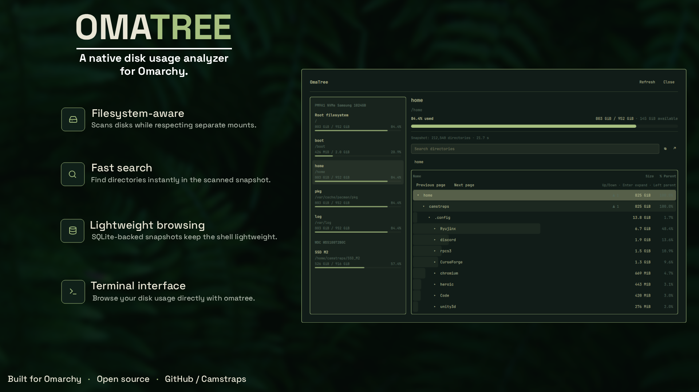

# OmaTree

OmaTree is an Omarchy disk-usage analyzer inspired by TreeSize and ncdu. It
provides a native Quickshell panel, a lightweight capacity bar widget, and an
optional curses terminal interface.



## Install

Install and enable **OmaTree** from the Omarchy Marketplace, then restart the
shell if prompted.

Alternatively, install the plugin directly from GitHub:

```bash
omarchy plugin add https://github.com/Camstraps/omatree.git --enable
omarchy restart shell
```

## Use the panel

Left-click the OmaTree bar widget to open the panel. Right-click the widget to
cycle its capacity display mode. The widget itself performs only lightweight
capacity discovery and never starts a recursive scan.

Choose a filesystem in the panel to browse its directories and immediate
files. Directories appear first, followed by files; each group is ordered by
size. Files are not expandable.

OmaTree keeps a separate persistent snapshot for each filesystem. Opening the
panel or switching between filesystems immediately reuses the latest valid
snapshot, including when the panel or shell has been restarted. An automatic
scan occurs only when the selected filesystem has no valid compatible
snapshot.

Use **Rescan** to refresh a snapshot explicitly. The replacement is built in
the background while the current snapshot remains browseable, and becomes
visible only after successful validation. A failed or cancelled rescan leaves
the previous snapshot untouched and does not affect snapshots for other
filesystems.

Search covers directory names across the complete active snapshot. Immediate
file rows are browseable, but file search is not included in v0.2.1.

## Highlights

- Filesystem capacity overview with physical-disk grouping where available
- Filesystem-aware scanning with explicit nested-mount pruning
- Persistent, per-filesystem SQLite snapshots
- Bounded lazy pagination for directories with very large numbers of entries
- Snapshot-wide directory-name search and breadcrumb navigation
- Allocated-size accounting (`st_blocks * 512`) with hardlink deduplication
- Symlinks are never followed
- Atomic, cancellable background rescans

## Terminal interface

Run the launcher directly (the default target is `$HOME`):

```bash
~/.config/omarchy/plugins/io.github.camstraps.omatree/bin/omatree
~/.config/omarchy/plugins/io.github.camstraps.omatree/bin/omatree ~/Downloads
```

The TUI is directory-only in v0.2.1. It shares OmaTree's scanner, mount policy,
allocated-size accounting, hardlink handling, and symlink safety.

To optionally install `omatree` as a shell command, run:

```bash
~/.config/omarchy/plugins/io.github.camstraps.omatree/bin/omatree install-cli
omatree ~/Downloads
```

This explicitly creates an OmaTree-owned symlink at `~/.local/bin/omatree`;
enabling the plugin never changes that directory automatically. The installer
is idempotent and refuses to overwrite unrelated paths. Before removing the
plugin, remove its symlink with:

```bash
omatree uninstall-cli
```

TUI controls: Up/Down or `k`/`j` move; Enter toggles a directory; Right/`l`
expands; Left/`h` collapses; Backspace selects the parent; Home, End, Page Up,
and Page Down move farther; `r` rescans; `q` quits. During scanning, `q` or
Ctrl-C cancels without committing a partial result.

## Architecture and safety

The Python scanner writes finalized records directly into a SQLite snapshot.
A panel-owned broker validates and atomically activates snapshots, then serves
bounded pages for browsing, breadcrumbs, and search. Quickshell never retains a
complete filesystem tree. Large directories remain paginated, and opening,
navigation, filesystem switching, and search do not rescan the filesystem.

Snapshots are private per-user cache data. Schema-incompatible or corrupt
snapshots are ignored and rebuilt safely. Scanner, database, protocol, parser,
and frontend caches all enforce explicit resource ceilings. The bar widget
never starts recursive work and no root privileges are required.

## Updating and removal

```bash
omarchy plugin update io.github.camstraps.omatree --yes
omarchy restart shell
```

Before removing the plugin, optionally run `omatree uninstall-cli`. Cached
snapshots are disposable and may be removed from `$XDG_CACHE_HOME/omatree`
(normally `~/.cache/omatree`) while OmaTree is closed.

## Release notes

### v0.2.1

- Persists an independent snapshot for each filesystem across panel and shell
  restarts.
- Reuses the selected filesystem's snapshot when opening from the bar widget
  and when switching filesystems, avoiding unnecessary rescans.
- Adds explicit background **Rescan** with atomic per-filesystem replacement;
  the previous snapshot remains available if a rescan fails or is cancelled.
- Adds bounded, paginated immediate-file browsing with directories first and
  files second, ordered by size within each group.
- Keeps snapshot-wide search and the TUI directory-only for this release.

### v0.2.0

- Replaced the complete QML tree with broker-owned SQLite snapshots and bounded
  lazy browsing/search state.
- Added the curses TUI and opt-in CLI symlink installer.
- Hardened executable identities, subprocess lifecycles, protocol bounds,
  snapshot validation, and cleanup for Marketplace review.

## Development

```bash
/usr/bin/python3 -m unittest discover -s tests
omarchy plugin validate .
qmllint -I /usr/share/omarchy/shell Panel.qml BarWidget.qml
git diff --check
```

See [CONTRIBUTING.md](CONTRIBUTING.md). OmaTree is available under the
[MIT License](LICENSE).
